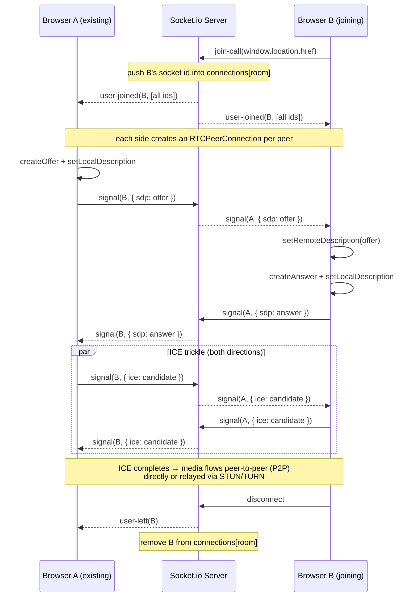
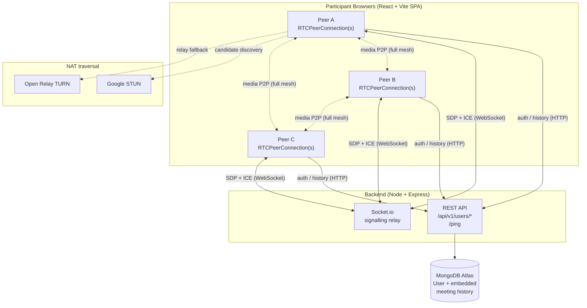
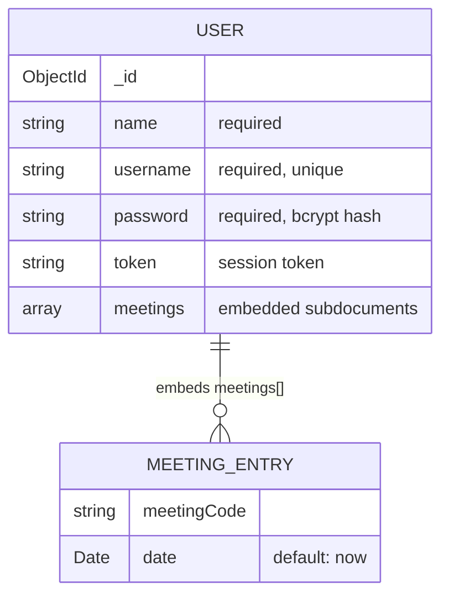

# RTCMeet

> A full-mesh, peer-to-peer video conferencing app built on the MERN stack and native WebRTC — Socket.io is used purely as a signalling relay, and media never touches the server.

---

## Overview

RTCMeet is a browser-based group video-calling app (a small Google-Meet-style clone). A user signs up, logs in, and either joins a room by typing a meeting code or shares a room link with others. Everyone who lands on the same URL is placed in the same call.

**What makes it interesting** is the media architecture: there is **no media server (SFU/MFU)**. Every participant opens a direct `RTCPeerConnection` to every *other* participant — a **full-mesh** topology. The backend's only job in a live call is to shuttle WebRTC signalling messages (SDP offers/answers and ICE candidates) between the right browsers over Socket.io. Audio and video flow browser-to-browser, optionally punched through NAT via public STUN/TURN servers.

The rest of the backend is a thin Express + MongoDB API for username/password auth and per-user meeting history.

---

## Key Features

- **Multi-party video calls** over full-mesh WebRTC (each peer connects directly to every other peer in the room).
- **Room = URL.** The room identifier is literally `window.location.href`, so any path (e.g. `/standup`, `/aljk23`) is a distinct room and the link *is* the invite.
- **In-call text chat** relayed through Socket.io, with an unread-message badge.
- **Mic / camera toggles** that enable/disable local tracks without renegotiating.
- **Screen sharing** via `getDisplayMedia`, which replaces the outgoing stream and re-offers to all peers.
- **Pre-join lobby** with a live camera preview and a display-name prompt before connecting.
- **Username / password auth** with bcrypt-hashed passwords and a token-based session.
- **Per-user meeting history** — each joined meeting code + timestamp is appended to the user's record and shown on a History page.
- **Guest access** — the landing page can drop you straight into a room without an account.

---

## How It Works — WebRTC Signalling Sequence

When a browser joins a room it emits `join-call` with the room key (`window.location.href`). The server tracks room membership in an in-memory map and tells everyone in the room who is present. Each browser then creates a peer connection per other participant and negotiates directly. The server only forwards `signal` messages (SDP + ICE) verbatim between two socket IDs.



ICE candidates that arrive before the remote description is set are **queued client-side** (`iceCandidateQueue`) and flushed once `setRemoteDescription` resolves, which avoids dropped candidates during the offer/answer race.

---

## Architecture



- **Media** (audio/video) travels directly between browsers — never through the backend.
- **Signalling** (SDP/ICE) travels over Socket.io.
- **Everything else** (auth, history) is plain HTTP against the Express API.

---

## Tech Stack

| Layer | Technology | Why |
|-------|-----------|-----|
| Frontend framework | React 19 + Vite 7 | SPA with fast dev server / build; React 19 for the UI |
| Routing | react-router-dom 7 | Client-side routes incl. `/:url` as the dynamic room path |
| UI | MUI (Material UI) 7 + Emotion | Prebuilt components, icons, and theming |
| HTTP client | axios | Auth + history REST calls |
| Realtime (client) | socket.io-client 4 | WebRTC signalling channel |
| Media | Native WebRTC (`RTCPeerConnection`, `getUserMedia`, `getDisplayMedia`) | Browser-native P2P media, no media-server dependency |
| Backend | Node.js + Express 5 (ESM) | REST API + HTTP server that Socket.io attaches to |
| Realtime (server) | socket.io 4 | Relays signalling between peers; tracks room membership in memory |
| Database | MongoDB + Mongoose 9 | Stores users and embedded meeting history |
| Auth | bcrypt (cost 10) + `crypto.randomBytes` token | Password hashing + token-based session |
| Status codes | http-status | Named HTTP status constants |
| NAT traversal | Google STUN + Open Relay TURN | Candidate discovery + relay fallback for restrictive networks |

---

## Project Structure

```
rtcmeet/
├── backend/
│   ├── .env.sample                     # MONGODB_URI, PORT
│   └── src/
│       ├── app.js                      # Express app, /ping, Mongo connect, HTTP + Socket.io boot
│       ├── controllers/
│       │   ├── socketManager.js        # Socket.io signalling relay (join-call, signal, chat, disconnect)
│       │   └── user.controller.js      # register / login / history handlers
│       ├── models/
│       │   ├── user.model.js           # User schema + embedded meetings[]
│       │   └── meeting.model.js        # standalone Meeting schema (reserved for future use)
│       └── routes/
│           └── users.routes.js         # /api/v1/users/* routes
└── frontend/
    ├── index.html
    ├── vite.config.js
    └── src/
        ├── main.jsx
        ├── App.jsx                     # Routes (landing, auth, home, history, /:url room)
        ├── environment.js              # API base URL (VITE_API_URL || http://localhost:8000)
        ├── contexts/AuthContext.jsx    # login/register/history API calls + token in localStorage
        ├── utils/withAuth.jsx          # HOC route guard (redirects to /auth if no token)
        └── pages/
            ├── landing.jsx             # Public landing + guest join
            ├── authentication.jsx      # Login / register form
            ├── home.jsx                # Enter meeting code → join room (auth-guarded)
            ├── history.jsx             # Past meetings list (auth-guarded)
            └── VideoMeet.jsx           # Lobby + full-mesh WebRTC call + chat
```

---

## Core Implementation

### Full-mesh peers

`VideoMeet.jsx` keeps a plain `connections` object mapping each remote `socketId` to its own `RTCPeerConnection`. When `user-joined` fires, the client iterates over the full participant list from the server and creates one peer connection for **every** other participant (skipping itself), attaching the local media tracks to each. There is no central mixer — with *N* participants each browser maintains *N − 1* connections and *N − 1* outbound media streams, keeping media fully peer-to-peer and off the server.

### Signalling

All SDP and ICE traffic rides a single Socket.io event, `signal`, addressed by socket ID:

- The server's `signal` handler is a pure relay: `io.to(toId).emit("signal", socket.id, message)`.
- The client serializes payloads as JSON and disambiguates by shape — `{ sdp }` vs `{ ice }` — in `gotMessageFromServer`.
- The offer/answer/ICE dance runs entirely between browsers; the server never inspects the payload.

Room membership lives in fast in-memory maps on the server (`connections`, `messages`, `timeOnline`) keyed by room, so signalling and presence stay lightweight.

### Session token

Login (`user.controller.js`) verifies the password with `bcrypt.compare`, then mints a random session token via `crypto.randomBytes(20).toString("hex")`, saves it on the user document, and returns `{ token, message }`. The frontend stores it in `localStorage` and passes it as a query/body param to authenticate history calls, and `withAuth` guards protected routes by checking for the token.

---

## API Endpoints

Base path: `/api/v1/users`

| Method | Endpoint | Body / Query | Success | Description |
|--------|----------|--------------|---------|-------------|
| `POST` | `/api/v1/users/register` | `{ name, username, password }` | `201 Created` `{ message }` | Create a user; bcrypt-hashes the password. Returns `302` if username already exists. |
| `POST` | `/api/v1/users/login` | `{ username, password }` | `200 OK` `{ token, message }` | Verify credentials, mint + store a session token. `404` if user not found, `401` on bad password. |
| `POST` | `/api/v1/users/add_to_activity` | `{ token, meeting_code, date }` | `202 Accepted` `{ message }` | Append a meeting to the user's history. `404` if token has no user. |
| `GET` | `/api/v1/users/get_all_activity` | `?token=<token>` | `200 OK` `[ meetings ]` | Return the user's embedded meeting history array. `404` if token has no user. |

Plus a health check outside the users router:

| Method | Endpoint | Success | Description |
|--------|----------|---------|-------------|
| `GET` | `/ping` | `200 OK` `{ status: "ok", uptime }` | Liveness check; `uptime` is `process.uptime()` in seconds. |

---

## Socket.io Events

Single namespace, addressed by socket ID. The room key is the joining client's `window.location.href`.

### Client → Server

| Event | Payload | Purpose |
|-------|---------|---------|
| `join-call` | `path` (the room = `window.location.href`) | Join a room; server registers the socket and broadcasts `user-joined`. |
| `signal` | `toId, message` (JSON string: `{ sdp }` or `{ ice }`) | Relay one signalling message to a specific peer. |
| `chat-message` | `data, sender` | Broadcast a chat message to everyone in the sender's room. |
| `disconnect` | *(built-in)* | Triggers cleanup + `user-left` broadcast to the room. |

### Server → Client

| Event | Payload | Purpose |
|-------|---------|---------|
| `user-joined` | `socketId, clients[]` | Someone joined; carries the full current participant list so clients can create peer connections. |
| `signal` | `fromId, message` | A relayed signalling message from another peer (SDP or ICE). |
| `chat-message` | `data, sender, senderSocketId` | A chat message broadcast to the room. |
| `user-left` | `socketId` | A peer disconnected; clients tear down that video tile. |

---

## Data Model

The app persists a single collection: **User**. Meeting history is stored as an **embedded array on the user document** (`meetings[]`), which keeps each user's history in one document. A `meeting.model.js` file describes a standalone `Meeting` collection, reserved for a future move to a separate collection.



---

## Setup & Installation

### Prerequisites

- **Node.js 18+** (Express 5 / Vite 7 / ESM).
- **A MongoDB connection string** (e.g. a MongoDB Atlas cluster).
- A browser with WebRTC support.

### 1. Clone

```bash
git clone <repo-url> rtcmeet
cd rtcmeet
```

### 2. Install dependencies (both apps)

```bash
# Backend
cd backend
npm install

# Frontend
cd ../frontend
npm install
```

### 3. Configure environment

Create `backend/.env` (you can copy `backend/.env.sample` as a starting point):

```env
MONGODB_URI=<your-mongodb-connection-string>
PORT=8000
```

Use your own MongoDB connection string for `MONGODB_URI` (for example, a MongoDB Atlas cluster).

The frontend defaults to `http://localhost:8000` for the API. If your backend runs elsewhere, create `frontend/.env`:

```env
VITE_API_URL=http://localhost:8000
```

### 4. Run (development)

Open two terminals.

**Backend** (from `backend/`):

```bash
npm run dev     # nodemon src/app.js  (auto-reload)
# or
npm start       # node src/app.js
```

On boot it connects to `${MONGODB_URI}/rtcmeet` and listens on `PORT` (falls back to **3000** if `PORT` is unset — note `.env.sample` sets it to 8000, which matches the frontend default).

**Frontend** (from `frontend/`):

```bash
npm run dev     # Vite dev server
```

Then open the Vite URL printed in the console. Register or log in, enter a meeting code on the Home page to create/join a room, and share the resulting URL with others to bring them into the same call.

Frontend build / preview:

```bash
npm run build     # production build
npm run preview   # serve the build locally
```

---

## Environment Variables

### Backend (`backend/.env`)

| Variable | Required | Default (in code) | Description |
|----------|----------|-------------------|-------------|
| `MONGODB_URI` | Yes | — | MongoDB base connection string; the app appends `/rtcmeet` as the DB name. |
| `PORT` | No | `3000` | Port the HTTP + Socket.io server listens on. `.env.sample` sets it to `8000`. |

### Frontend (`frontend/.env`)

| Variable | Required | Default (in code) | Description |
|----------|----------|-------------------|-------------|
| `VITE_API_URL` | No | `http://localhost:8000` | Base URL of the backend for REST + Socket.io. |

